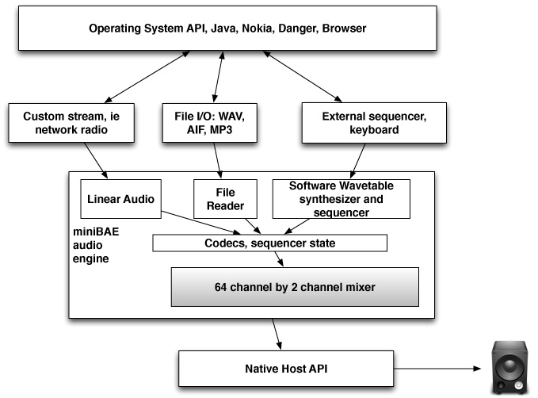

# What is miniBAE?

 The platform neutral
 Beatnik Audio Engine, mini edition (miniBAE) is an exceptionally
 mature, well rounded, and reliable computer music and sound system
 specially customized for small footprint and embedded applications.

Table of Contents (TOC)
=======================

   * [miniBAE](#miniBAE)
   * [Flexible](#flexible)
   * [Interactivity Oriented](#interactivity-oriented)
   * [Great Sounding](#great-sounding)
   * [Powerful and Extensible](#powerful-and-extensible)
   * [Efficient](#efficient)
   * [Hardware Independent – Sound Card Agnostic](#hardware-independent-sound-card-agnostic)
   * [Consistent Across Plattforms](#consistent-across-plattforms)
   * [An Inexpensive Cross Platform Audio Solution](#an-inexpensive-cross-palform-audio-solution)
   * [Why do we care?](#why-do-we-care)
   * [What can it be used for](#what-can-it-be-used-for)
   * [What’s is cost?](#whats-is-cost)
   * [What happen to beatnik](#What-happen-to-beatnik)
   * [What’s with all this Javascript code](#whats-with-all-this-javascript-code)
   * [What’s left to be done](#whats-left-to-be-done)
   * [New BSD License](#new-bsd-license)
   * [Acknowledgment](#acknowledgement)
   * [Software](#software)
   * [Business Development](#business-development)
   * [Sound Design, Music Design](#sound-design-music-design)
  
---  
  
## miniBAE is...

### Flexible

 It can play several leading industry standard music and audio file formats from disk or from memory.  

### Interactivity oriented

 You can pause and resume any media playback at will, change pitch while a sound is playing, etc. The feature-rich miniBAE API is full of
 opportunities for innovative integration of sound design into
 interactive virtual worlds, for example, miniBAE includes a MIDI synthesizer that your application, or user, can play in real-time.
  
### Great Sounding

 The audio engine DSP quality is very good, comparable to high-end PC
 wavetable sound cards even though the processing is entirely
 software-based, and audio quality is selectable all the way from 8-bit
 8 kHz up to 16-bit 44.1 kHz.
  
### Powerful and Extensible

 The miniBAE music synthesizer is a high-quality wavetable instrument with LFOs, ADSRs, and filters. It can be delivered with a complete
 General MIDI patch bank, or for small footprints a ‘light’ General MIDI
 approximation can be used. Custom instrument banks can be built with the Beatnik Editor application.

### Efficient

 Despite miniBAE’s power, the per-voice processor load is impressively
 low.
  
### Hardware Independent – Sound Card Agnostic
  
 Some other sound systems require consumers to buy expensive (and
 quickly outdated) hardware sound cards – but miniBAE avoids nearly
 all sound card support issues because it’s 100% software. miniBAE
 requires no particular sound hardware in the host system, only an audio
 output.

### Consistent Across Platforms
  
 Because it’s a software-only solution, consistently great sounding music is much easier to achieve with miniBAE than with many other computer music systems.  

### An Inexpensive Cross-Platform Audio Solution

 miniBAE provides the same music and sound capabilities on every supported platform, so porting music and sound content is a
 no-brainer, requiring literally no additional sound artist work –
 simply reuse the files. Abstracted high-performance audio mixing engine. Designed for very low latency. Very efficient.

### Why do we care?
Interactive audio is the core need for quality video games and sonified UIX.
Audio is one of the senses, and any platform without good support suffers.

### What can it be used for?
Playing just about any kind of audio content. Either stored locally, via a network stream or stored in an application.
From the application, there are all kinds of ways to hook into the media as it plays.
User feedback for visually impaired. Sonified UIX.
Instantly create musical instruments out of any device or screen.

### What’s is cost?
 Free. BSD license.

### What happened to Beatnik?
 Beatnik ended business December 2009. Decided to release the miniBAE source as a BSD license rather than let it disappear.

### What’s with all this Javascript code?
 miniBAE’s first incarnation was a plugin for web browsers than included almost a feature for feature Javascript API to match the native API’s. That code is also in the release for potential reuse in Browsers or Frameworks that support Javascript.

### What’s left to be done?
 If the Javascript code is to be used, it will have to be modernized, and a layer between Javascript and the Native code will have to be written.
 A Native Host will have to be written for each platform you want to support. The code release includes Mac OSX, Windows, iOS.

### New BSD License

    Copyright (c) 2009 Beatnik, Inc All rights reserved.  
      
    Redistribution and use in source and binary forms, with or without  
    modification, are permitted provided that the following conditions are  
    met:  
      
    Redistributions of source code must retain the above copyright notice,  
    this list of conditions and the following disclaimer.  
      
    Redistributions in binary form must reproduce the above copyright notice, this list of conditions and the following disclaimer in the documentation and/or other materials provided with the distribution.  
      
    Neither the name of the Beatnik, Inc nor the names of its contributors may be used to endorse or promote products derived from this software without specific prior written permission.  
      
    THIS SOFTWARE IS PROVIDED BY THE COPYRIGHT HOLDERS AND CONTRIBUTORS "AS  
    IS" AND ANY EXPRESS OR IMPLIED WARRANTIES, INCLUDING, BUT NOT LIMITED  
    TO, THE IMPLIED WARRANTIES OF MERCHANTABILITY AND FITNESS FOR A  
    PARTICULAR PURPOSE ARE DISCLAIMED. IN NO EVENT SHALL THE COPYRIGHT  
    HOLDER OR CONTRIBUTORS BE LIABLE FOR ANY DIRECT, INDIRECT, INCIDENTAL,  
    SPECIAL, EXEMPLARY, OR CONSEQUENTIAL DAMAGES (INCLUDING, BUT NOT LIMITED  
    TO, PROCUREMENT OF SUBSTITUTE GOODS OR SERVICES; LOSS OF USE, DATA, OR  
    PROFITS; OR BUSINESS INTERRUPTION) HOWEVER CAUSED AND ON ANY THEORY OF  
    LIABILITY, WHETHER IN CONTRACT, STRICT LIABILITY, OR TORT (INCLUDING  
    NEGLIGENCE OR OTHERWISE) ARISING IN ANY WAY OUT OF THE USE OF THIS  
    SOFTWARE, EVEN IF ADVISED OF THE POSSIBILITY OF SUCH DAMAGE.  

---  

### Acknowledgment:

 Everyone on this list made a contribution in some important way. Its amazing to me that two scruffy guys working in our house created something that went around the world and in lots of peoples pockets.

Thank you all.  

Steve Hales - steve@igorlabs.com  

#### Software
  
Steve Hales - Halestorm/Igor Labs/Beatnik/Danger   
Jim Nitchals - Halestorm/Igor Labs/Beatnik  
Chris Muir - Beatnik  
Chris van Rensburg - Beatnik  
Christopher Schardt - Beatnik  
Mark Deggeller - Beatnik  
Doug Scott - Beatnik/Danger  
Andrew Ezekiel Rostaing - Beatnik  
Chris Grigg - Beatnik  
Sean Echevarria - Beatnik  
Kara Kytle - Sun Microsystems - Javasoft  
Chris Rogers - Beatnik  
Jarrell Irvin - Danger  
Ian MacDonald - Sapien Technologies  
  
#### Business Development  
Don Millers - Beatnik  
Gavin Bourne - Beatnik  
Thomas Dolby - Headspace/Beatnik  
Mary Coller Albert - Headspace/Beatnik  
John Eckstein - Beatnik  
Dane Bigham - Presage Software  
Steve Hales - Halestorm/Igor Labs/Beatnik/Danger  
Jim Nitchals - Halestorm/Igor Labs/Beatnik  
Brian Hales - Halestorm  
Brett Durrett - Halestorm  
Joe Britt - WebTV/Danger  
Andy Rubin - WebTV/Danger  
David Rivas - Sun Microsystems - Javasoft  
Bruce Leak - Apple/General Magic/WebTV  
Phil Goldman - Apple/WebTV  
Kari Johnson - Beatnik  
Matti Hamalainen - Nokia  
Jukka Holm - Nokia  
Jacek Horos - Nokia  
Mickey Mantle - Brøderbund Software  
Doug Carlston - Brøderbund Software  
Will Wright - Maxis Software/EA  
Ken Grant - Pixellite Software  
Paul Lamoreux - Sapien Technologies   
Ferdinand Rios - Sapien Technologies  
  
#### Sound Design, Music Design  
Thomas Dolby - Headspace/Beatnik  
Brian Salter - Presage Software/Beatnik  
Michael Pukish - Presage Software  
Kim Cascone - Beatnik  
Blake Leah - Beatnik  
Chris van Rensburg - Beatnik  
Steven Clark - Beatnik  
Thomas Dimuzio - Beatnik  
Tom Rettig - Brøderbund Software  
Chris Perry - Halestorm  
Sal Orlando - Beatnik  
Peter Drescher - Halestorm  

---
